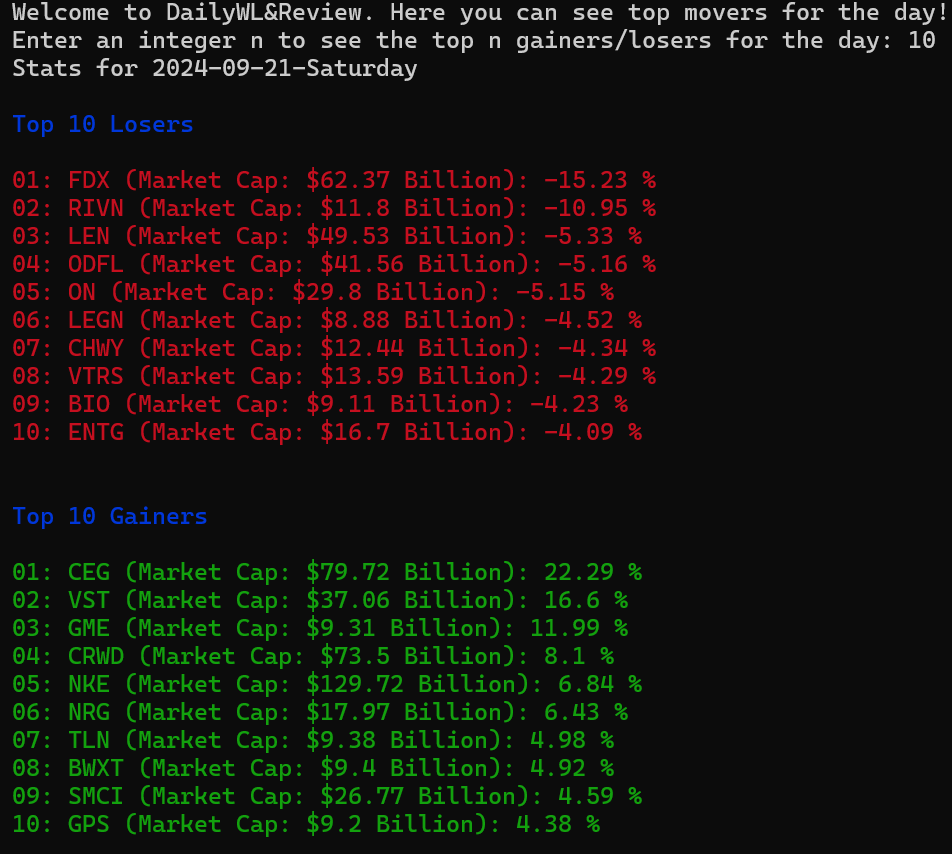
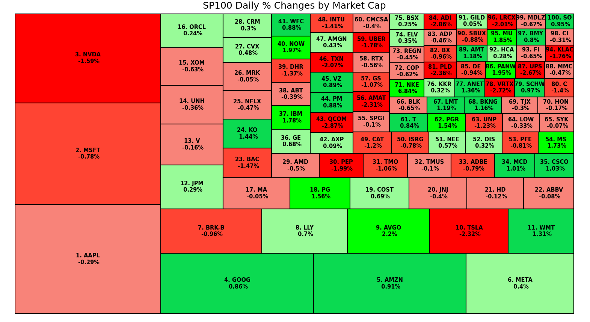

# Daily Watch List
Simple web scraper tool to find the stocks making the biggest moves daily. Lets the user see the top n gainers/loser stocks for a trading day, as well as a heatmap to better visualzie how the overall market was on a given day. 
## How to Use
To use this code, clone the repository, install the necessary python modules if they aren't already installed, then **type *python main.py*** in the terminal/command prompt after navigating to the directory with main.py file.
### Images
Here is an example list of stocks showed by the program when run on a Saturday(returns the previous trading day's information)

The heatmap for that day looks as follows and is only presented if ***y*** is pressed after the list of stocks is shown

